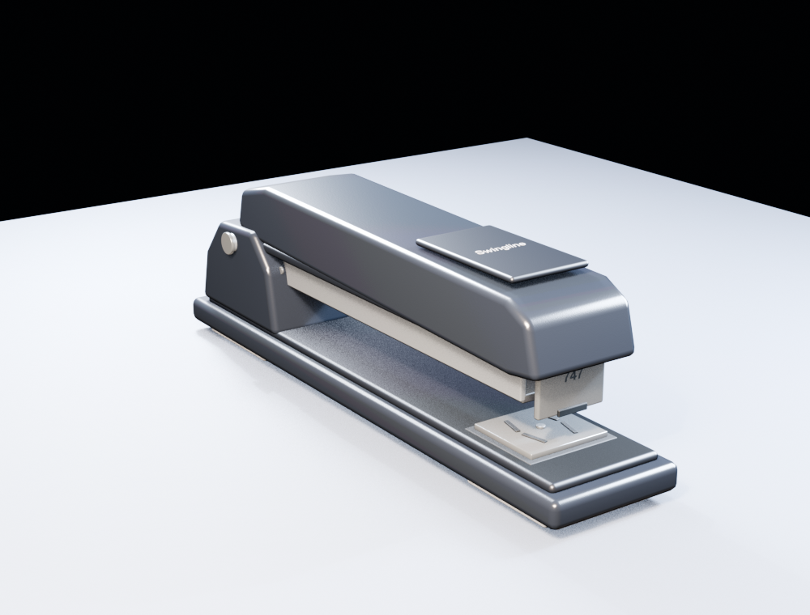
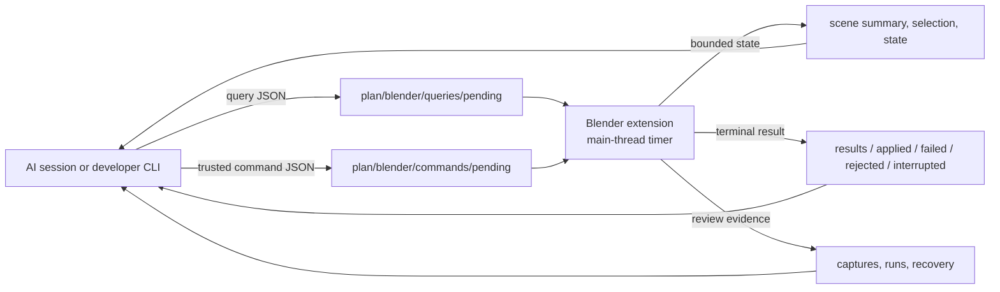

# Alepou Blender Bridge

**An auditable local bridge that lets AI coding sessions observe, author, inspect, and repair real Blender scenes.**

Alepou Blender Bridge keeps Blender authoritative. It does not turn `.blend` files into text, replace native Blender techniques with a reduced modelling language, or run `bpy` from a background socket thread. The extension exports bounded project state, accepts atomic local requests, executes Blender work on the main thread, and preserves exact results plus visual evidence for review.

The bridge can be used directly through its file contract or optional CLI. [Alepou](https://alepou.ai) is the recommended control plane when the work also needs durable plans, task/commit history, cross-session memory, phone oversight, or autonomous launch of a project-bound Blender session.

> **Alpha:** use version control and preserve source `.blend` files. Local Trusted Development permits arbitrary recorded Blender Python with the Blender process's user privileges. A failed script may already have changed the scene; a recovery snapshot is not an automatic rollback.

## What It Enables

- Bind a specific Blender process to a canonical project, with fresh health and instance identity.
- Read compact scene and selection maps without dumping a large scene into model context.
- Ask targeted questions about objects, evaluated bounds, topology, materials, distances, alignment, and conservative intersections.
- Capture deterministic clay, studio, silhouette, wireframe, viewport, or scene-lit evidence fitted to the requested subject.
- Run recorded inline `bpy` scripts under Blender-local authority, with source, hash, output, timings, fingerprints, and recovery evidence retained.
- Inspect the result, enumerate defects, repair them, and save the accepted native Blender artifact.
- Keep multiple Blender windows isolated by `instanceId`; a processor never claims a request addressed to another instance.

## Production Evidence: 90s_Office

These are retained outputs from the ongoing **90s_Office** VR production, not generated marketing mockups. Each period product was researched, constructed as its own native Blender source asset, checked with exact queries and multiple rendered views, repaired, and accepted before Unity assembly.

<table>
  <tr>
    <td width="33%"></td>
    <td width="33%"></td>
    <td width="33%"></td>
  </tr>
  <tr>
    <td align="center"><strong>Casio HR-170LB</strong><br/>Printing calculator</td>
    <td align="center"><strong>Swingline 747</strong><br/>Desk stapler</td>
    <td align="center"><strong>Sony CPD-200ES</strong><br/>CRT monitor</td>
  </tr>
</table>

The larger office is still in progress. These images evidence individually accepted source assets and the bridge's research/build/inspect/repair loop; they are not a claim that the final room is complete.

## The Closed Loop

1. **Bind and verify.** Read `bridge-health.json` first. Continue only when the processor is active, fresh, and bound to the intended canonical project and Blender instance.
2. **Map before drilling down.** Use `scene-summary.json` and `selection.json` for the compact map, then submit bounded queries for the exact objects and properties that matter.
3. **Author natively.** Use recorded inline `script.execute` requests, choosing the Blender technique that fits the form: mesh editing, curves, subdivision, booleans, bevels, modifiers, sculpting, Geometry Nodes, or other native tools.
4. **Inspect exact state.** Check authored and evaluated bounds, mesh statistics, attachment distances, alignment, and likely intersections.
5. **Inspect visual evidence.** Capture several useful, well-lit, closely framed views that expose silhouette, surfaces, attachments, and hidden relationships.
6. **Repair all observed defects.** A successful script is only a transport result. Acceptance comes after the geometry and evidence agree.
7. **Save the accepted source.** Preserve the `.blend`, scripts, terminal results, captures, and project task/commit record needed for downstream assembly.

## Architecture



The extension watches `<project>/plan/blender/` with atomic local file operations. A persistent `bpy.app.timers` callback claims work, and all `bpy` access stays on Blender's main thread. There is no persistent Python socket server or worker thread inside Blender.

Each processor has a stable process-lifetime `instanceId` and an isolated workspace under `plan/blender/instances/<instanceId>/`. A single fresh instance may also hold the short heartbeat lease for the compatibility queues at `plan/blender/`. Opening another `.blend` keeps the instance identity but changes the executor generation.

```text
plan/blender/
  bridge-health.json
  status.md
  capabilities.json
  scene-summary.json
  selection.json
  diagnostics.json
  state/
  queries/
    pending/
    results/
  commands/
    pending/
    processing/
    applied/
    failed/
    rejected/
    interrupted/
  captures/
  recovery/
  runs/
```

`capabilities.json` is authoritative for the installed bridge. Public documentation explains the model; live project files describe the exact available operations and current state.

## Installation

The current Blender extension manifest is **0.7.1** and supports Blender **4.1+**.

### Install through Alepou

The recommended route is the project's **Install / Update Bridge** button in Alepou. Alepou ships both packages, detects the selected Blender version, and asks Blender to install the correct one. Close running Blender windows before installing. Blender 4.2+ uses the extension package; Blender 4.1 uses the legacy add-on package.

### Install manually

Download the immutable packages from the [v0.7.1 GitHub release](https://github.com/alepou-ai/alepou-blender-bridge/releases/tag/v0.7.1):

- Blender 4.2+: choose `alepou_blender_bridge-0.7.1.zip` from **Edit > Preferences > Get Extensions > Install from Disk**.
- Blender 4.1: choose `alepou_blender_bridge-0.7.1-legacy.zip` from the Add-ons install control.
- Enable **Alepou Blender Bridge**.

To reproduce those packages from source:

Build the Blender 4.2+ extension and Blender 4.1 legacy add-on packages:

```powershell
python scripts\build_packages.py `
  --blender 'C:\Program Files\Blender Foundation\Blender 4.3\blender.exe'
```

The extension zip is the normal installation. Users do not install a Python wheel or run `pip`; the wheel and CLI are optional developer surfaces.

### Bind a project

With Alepou running:

1. Open the **Alepou** tab in Blender's 3D View sidebar (`N`).
2. Click **Refresh Alepou Projects**.
3. Select the exact project; the canonical root is shown so duplicate names remain unambiguous.
4. Click **Bind and Initialize**.
5. Verify that `<project>/plan/blender/bridge-health.json` is fresh and reports the intended project, `.blend`, `instanceId`, and `processorActive: true`.

Project discovery uses Alepou's loopback-only, per-run authenticated local capability. A manual project-root field remains available for direct/offline use. Binding always returns Blender to **Observation Only**.

## Authority and Stop Controls

**Observation Only** is the default. It permits fresh state export, bounded queries, and diagnostic capture.

Recorded `script.execute` and other scene mutations require Blender-local **Local Trusted Development**. The user enables it in Blender and may bind it to one Alepou session id. It remains active until revoked, the project binding changes, or Blender closes. Alepou can report and use this authority; it cannot create or widen it.

**STOP Bridge** is always available in Blender's Alepou sidebar. It rejects queued requests and blocks new claims. Python already executing on Blender's main thread cannot be forcibly terminated safely; stop/revoke controls apply at request boundaries.

Projects that explicitly opt into Alepou's audited autonomous authoring can ask Alepou's authenticated local integration to start a visible project-bound Blender process. The durable launch job and fresh instance record provide the real project, grant, and instance identities. Starting Blender does not grant Local Trusted Development and does not bypass Blender's stop controls.

## Requests and Results

Mutation request example:

```json
{
  "schemaVersion": 1,
  "commandId": "cmd-build-chair-001",
  "target": {"instanceId": "blender-7f4c91a2b038"},
  "sessionId": "optional-owning-alepou-session",
  "title": "Build chair prototype",
  "intent": "Create the first inspectable blockout",
  "actions": [
    {
      "action": "script.execute",
      "source": "import bpy\nbpy.ops.mesh.primitive_cube_add()"
    },
    {"action": "state.refresh"}
  ]
}
```

Observation requests go to `queries/pending/`; trusted mutations go to `commands/pending/`. A processor atomically moves a command into `processing/` and terminates it in `applied/`, `failed/`, `rejected/`, or `interrupted/`. Executor restart moves an abandoned claim to `interrupted/` rather than replaying it. Never reuse a terminal `commandId`.

Representative observations:

- `bridge.ping`, `state.refresh`, `scene.summary`, `scene.list_objects`
- `object.inspect`, `object.bounds`, `mesh.stats`, `material.inspect`
- `scene.distance`, `scene.alignment`, `scene.intersections`
- `capture.diagnostic`, `capture.viewport`

Representative trusted mutations:

- `script.execute`
- `scene.save_copy`, `scene.restore_snapshot`
- `object.select`, `camera.ensure_standard`

Diagnostic capture supports named or caller-supplied directions, orthographic or perspective projection, and clay, studio, silhouette, wireframe, or scene-lit modes. Framing fits the requested subject's actual bounds, including small real-scale products. Agents can instead author project cameras and lighting when that communicates the work better.

## Recovery Semantics

Before each recorded script, the bridge saves a recovery snapshot and records the exact source/hash, stdout/stderr, elapsed time, and before/after scene fingerprints.

Those records make failures inspectable; they do not make arbitrary Python transactional. If a script throws after changing the scene, the result is `failed` and the mutation may remain. Do not claim rollback unless a separate `scene.restore_snapshot` request reaches an applied terminal result and the refreshed scene verifies the restore.

## Honest Limitations

- This is powerful local authoring, not a sandbox around Blender Python.
- Visual quality is not guaranteed by request success. Agents must inspect and repair their work.
- The bridge does not understand every Blender editor control as a typed command. Recorded `bpy` remains the productive authoring surface.
- Observation is live only while `bridge-health.json` is fresh; leftover scene files are not a connected Editor.
- Multi-instance routing prevents queue races, but callers still have to target the intended Blender instance.
- Autonomous launch is an Alepou integration feature, not a grant of Blender-local mutation authority.

## Optional Developer CLI

The thin CLI and Python wheel are useful for protocol development, external automation, and CI. They never import `bpy`:

```powershell
python -m pip install -e .
alepou-blender --project D:\path\to\project status
alepou-blender --project D:\path\to\project query scene.summary
alepou-blender --project D:\path\to\project script .\build_scene.py --session my-session
```

Every command prints one JSON envelope. `submit` accepts an existing request file for advanced use.

## Experimental Spatial Research

The repository retains a disabled-by-default Spatial authoring experiment under `src/spatial*`. Spatial normalizes a small semantic representation to one recorded `script.execute` request. It does not replace raw Blender Python, is not a general CAD or sculpting system, and is not part of the product-quality claim made by this README. The default project mode is `off`; no mode silently falls back between Spatial and raw `bpy`.

## Validation

Run the pure protocol and CLI suite:

```powershell
python -m unittest discover -s tests -v
```

Run the real Blender smoke test against a temporary project:

```powershell
& 'C:\Program Files\Blender Foundation\Blender 4.3\blender.exe' `
  --background --factory-startup --python scripts\blender_smoke.py -- `
  --project D:\temp\alepou-blender-smoke
```

The smoke covers health, atomic claims, exact state, trusted script execution, object inspection, diagnostic rendering, and save-copy evidence. Additional scripts in `scripts/` cover multi-instance routing, diagnostic capture, project binding, reference overlays, and the experimental Spatial and human-substrate work.

## Repository Layout

- `extension/alepou_blender_bridge/` — Blender extension/add-on and authoritative 0.7.1 manifest
- `src/alepou_blender/` — optional developer CLI for the local file contract
- `scripts/` — packaging and real-Blender validation
- `tests/` — pure protocol, CLI, discovery, and research tests
- `docs/images/` — retained production evidence used by this README

Apache-2.0 licensed. See [LICENSE](LICENSE).
